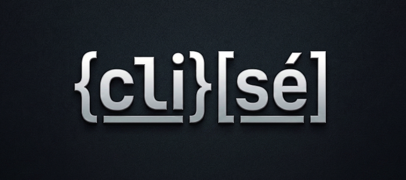

<p align="center">
  
</p>

<p align="center">
  
  
  
  
</p>

`clisé` is a terminal-based (TUI) JSON Schema configuration editor and command-line utility. It enables visual modification of structured data format files (such as **JSON**, **JSONC**, **YAML**, and **TOML**) directly within the command-line interface, while validating constraints and offering autocompletion powered by JSON Schemas.

Using its core library, `clisé` provides a unified interface to edit structured formats. The interactive TUI serves as both a practical utility and a reference implementation for integrating and building upon the core engine.

## Documentation

- **[TUI User Guide](docs/guide.md)**: Describes TUI interface components, editing operations, and keyboard shortcut sheets.
- **[CLI Command Reference](docs/command.md)**: Comprehensive manual for global arguments, subcommands, flags, and CLI scripts.
- **[Core Library API Reference](docs/reference.md)**: Complete library crate documentation for embedding or integrating `clisé` core modules.

## Key Features

- **Interactive TUI Tree View**: Navigate and modify deeply nested configurations easily using a keyboard-driven terminal layout (powered by [Ratatui](https://github.com/ratatui/ratatui)).
- **JSON Schema Integration**: Real-time schema validation, type hints, and contextual auto-completion for property keys and enum options.
- **Format Preservation**: Serializes documents while preserving original formatting structure, key ordering, and comments (supports JSONC, TOML, and YAML).
- **Format Conversion**: Convert files seamlessly between JSON, JSONC, YAML, and TOML via CLI subcommands.
- **Robust CLI Utility Suite**: Commands to `format`, `validate`, `init` skeleton templates, and configure schema catalogs (`schema`).
- **Undo/Redo History**: Full local transaction rollback capabilities for all edits and re-orderings in TUI mode.

---

## Installation

Install `clisé` using the installation script via `curl` or `wget`:

```bash
curl -o- https://raw.githubusercontent.com/0deep/clise/v0.1.0/install.sh | bash
```
```bash
wget -qO- https://raw.githubusercontent.com/0deep/clise/v0.1.0/install.sh | bash
```

> [!NOTE]
> The installer automatically creates a symbolic link `se` pointing to `clise` in `$HOME/.local/bin`. You can use `se` as a shorthand command (e.g., `se settings.yaml`).

---

## Quick Start Guide

### Launching TUI Editor
To open and edit a configuration file in TUI:
```bash
# Automatically detects file format
clise settings.yaml

# Override format parser and force-bind a JSON Schema URL
clise config.txt --format json --schema https://json.schemastore.org/tsconfig
```

### CLI Command Examples

#### 1. In-place Formatting & Conversion
```bash
# Prettify and format TOML config in-place
clise format Cargo.toml --write

# Convert a YAML file into JSON output stream
clise format options.yml --to json
```

#### 2. Schema Validation
```bash
# Validate package.json against the npm schema
clise validate package.json --schema https://json.schemastore.org/package
```

#### 3. Initialize from Schema
```bash
# Initialize a skeleton file based on schema properties
clise init tsconfig.json --schema https://json.schemastore.org/tsconfig
```

---

## License

see [LICENSE.md](LICENSE)
