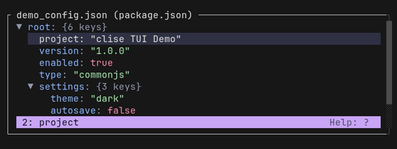
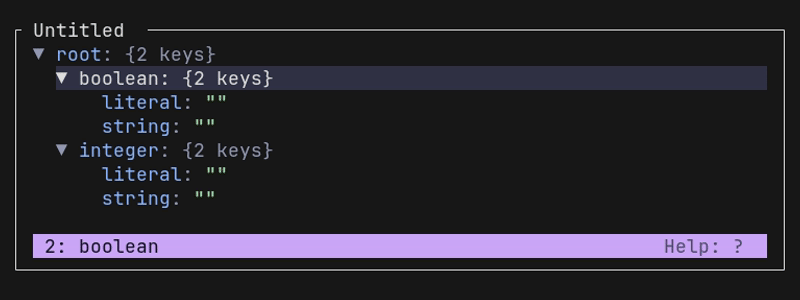
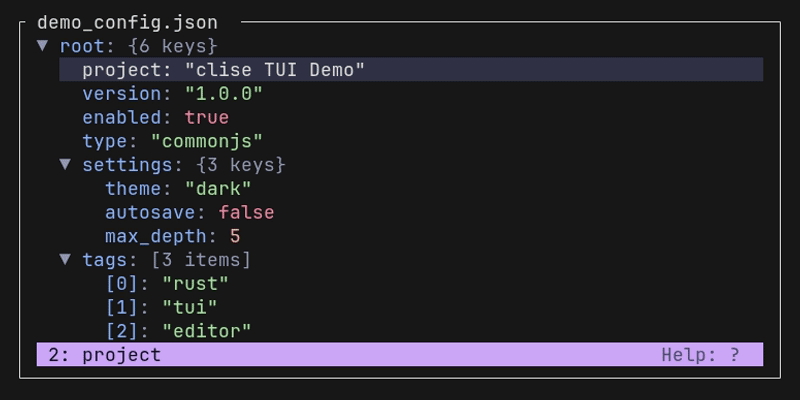
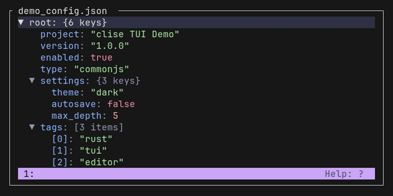
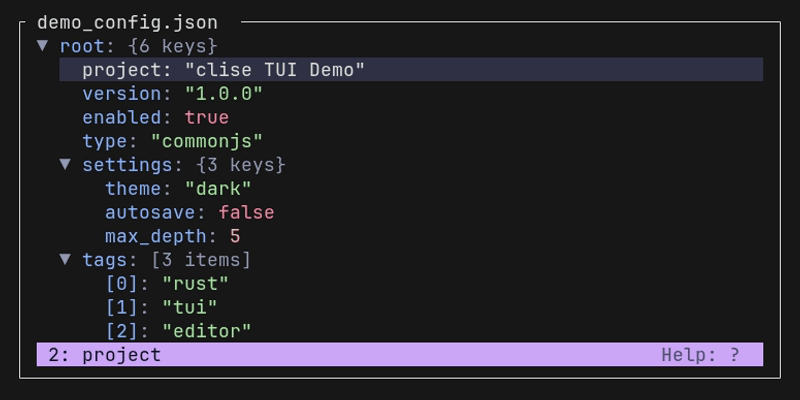
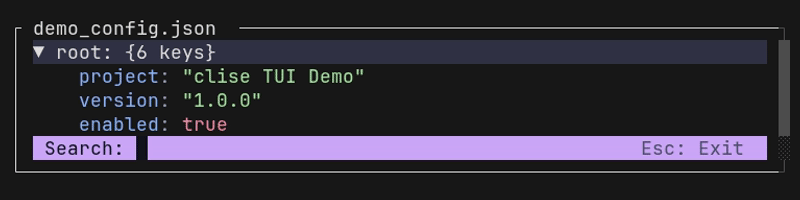
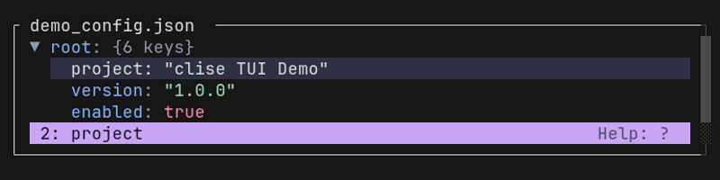
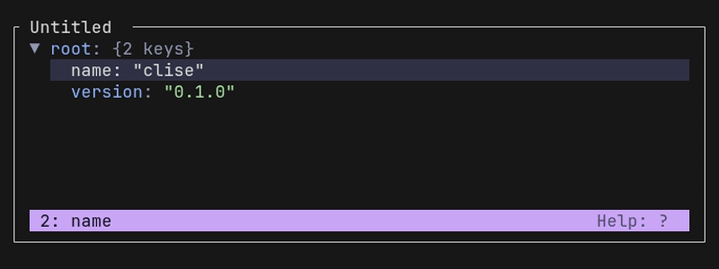

# User Guide

This document explains the editor interface, design layouts, core editing workflows, and JSON Schema integrations.

---

## 1. Editor Interface Layout

When you open a file in `clise`, the terminal layout is divided into three key visual areas:

1. **Main Editor Area (Tree View)**
   - Displays your configuration hierarchy as a flattened tree.
   - Indentation guides indicate parent-child block levels.
   - Highlighted background row shows the active cursor selection.
   - Displays type hints (e.g., `[string]`, `[bool]`) and child element counts next to keys.
   - The top border of the editor block displays the active filename and the loaded JSON Schema name.

2. **Scrollbar (Vertical Track)**
   - Appears on the right side of the screen when the document exceeds the vertical terminal window height.

3. **Status Bar**
   - Located at the bottom of the screen.
   - Shows the active JSON path of the selected node, schema loading status, temporary status messages, and short instruction hints (e.g., `Help: ?`).

---

## 2. Interactive Editing Workflows

### 2.1. Basic Cursor & Tree Navigation
- **Move Cursor**: Use `Up` and `Down` arrow keys to jump line-by-line.
- **Scroll Large Files**: Use `PgUp` and `PgDn` keys to scroll by terminal height pages.
- **Fold/Unfold Nodes**: Press `Space` or `Left` / `Right` arrow keys to expand or collapse parent containers (JSON Objects or Arrays).
- **Fast Traversal**: Press `Right` on an already expanded parent node to jump directly to its last child node. Press `Left` on a leaf node or collapsed parent to jump to its direct parent node.

---

### 2.2. Modifying Values & Types
Select a leaf node (such as a string, number, or boolean) and begin editing:
- **String & Number Editing**: Press `Enter` to open an inline text editor input prompt. Type changes and press `Enter` to confirm, or `Esc` to cancel.
- **Boolean Toggle**: Selecting a boolean node and pressing `Enter` instantly toggles it between `true` and `false`.
- **Reset/Clear Editing**: Press `Backspace` to clear the current value and open the input prompt immediately.
- **Schema-Based Dropdowns**: If a JSON Schema binds `enum` values to the property, pressing `Enter` opens a dropdown list of valid options. Use `Up`/`Down` to select and `Enter` to apply.



---

### 2.3. Value Type Inference & Parsing
When you input a value in the text prompt, the editor automatically infers the data type based on the format and schema:
- **Boolean**: Inputting `true` or `false` (without quotes) parses to a Boolean type.
- **Number**: Inputting plain numeric text (e.g., `42`, `-3.14`) parses to a Number type.
- **Explicit Strings (Quotes)**: If you want to force a value to be treated as a literal String (e.g., saving `true` or `123` as text rather than a boolean/number), wrap the input in single (`'`) or double (`"`) quotes. The editor will strip the outer quotes and preserve it as a String.
- **Schema Enforcement**: If a JSON Schema is loaded and specifies that the field must be a `string`, the input is saved as a String even if it matches number or boolean syntax.

*(Note: To initialize an empty Array or Object using `[]` and `{}`, see [Section 2.5](#25-adding-and-deleting-nodes).)*



---

### 2.4. Key Renaming
You can rename an existing key inside a JSON object:
- Select the node you want to rename.
- Press `Backspace`. This will trigger the **Rename Key Prompt** displaying the current key buffer.
- Edit the key name and press `Enter` to confirm the change.


---

### 2.5. Adding and Deleting Nodes
- **Add Nodes**: Press `Enter` on a parent container node (Object or Array).
  - If a schema is bound, it opens a dropdown listing allowed property keys.
  - If it's a generic object, you can input a custom key name.
- **Delete Nodes**: Press `d` or `Delete` on any node to remove it and its children.



To initialize an empty Object or Array when adding a new node, type `{}` or `[]` in the value editing prompt. You can then navigate into it and add nested nodes.



---

### 2.6. Reordering Keys and Array Items
- Use `Alt + Up` or `Alt + Down` to reorder the selected property within its parent object, or move an item up/down within its array.
- This changes the physical order in the saved file.
- Use `Ctrl + Up` or `Ctrl + Down` to jump the cursor to the previous/next sibling (skipping any expanded child subtree).



---

### 2.7. Search
- Press `/` to enter search mode.
- Type your query into the search buffer. The editor will dynamically filter, highlight, and jump to matching keys and values in real-time.
- Press `Enter` to close search and keep cursor at match, or `Esc` to cancel.



---

### 2.8. Undo and Redo History
- Press `U` to undo the last modifications.
- Press `R` to redo previously undone operations.
- The history stack tracks data modifications, cursor positions, key re-orderings, and renamed keys.



---

## 3. Piping and Standard Input (Stdin)

`clise` supports running in an interactive session without any source files by using shell pipeline streams. 

### 3.1. Basic Usage
To pass content directly, pipe it into the `clise` command. You can pass an empty JSON object or pre-filled configuration data:

```bash
# Pipe empty JSON
echo '{}' | clise --format json

# Pipe JSON with predefined configuration
echo '{"name": "clise", "version": "0.1.0", "dependencies": {"ratatui": "0.30"}}' | clise --format json
```



### 3.2. How Saving Works with Stdin
Because there is no target file path on the filesystem to write back to, saving works differently in this mode:
- When you press `S` (Save) or `Ctrl+S` (Save and Quit) inside the editor, the changes are stored in memory.
- Once the editor is closed, the final serialized layout is printed directly to **standard output (stdout)**.
- If you exit the editor via simple quit (`q` or `Esc`) without saving, nothing is printed to stdout.

---

## 4. Keyboard Shortcuts Cheat Sheet

Here is a quick summary of all keyboard shortcuts available in `clise` TUI mode:

| Shortcut Key | Function / Action |
| :--- | :--- |
| `?` | Toggle Help modal dialog |
| `/` | Enter real-time search mode |
| `S` | Save document changes |
| `U` | Undo last change |
| `R` | Redo last undone change |
| `T` | Toggle schema Type hints |
| `K` | Toggle child element counts display |
| `Up` / `Down` | Move selection cursor up / down |
| `Ctrl` + `Up` / `Down` | Shift selected node / item order up / down |
| `PgUp` / `PgDn` | Scroll viewport page up / down |
| `Left` | Collapse parent, or jump to parent node |
| `Right` | Expand parent, or jump to last child |
| `Space` | Toggle expansion state |
| `Enter` | Add child (on parent) or Edit value (on leaf) |
| `Backspace` | Clear value and Edit, or Rename current key |
| `D` or `Delete` | Delete selected node (and its children) |
| `Q` or `Esc` | Quit editor (prompts to save changes if dirty) |
| `Ctrl + C` | Force quit immediately without saving |
